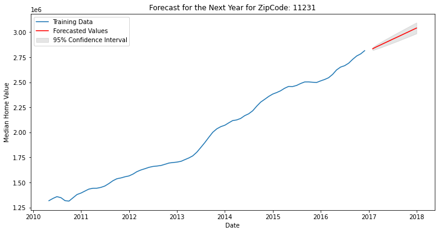
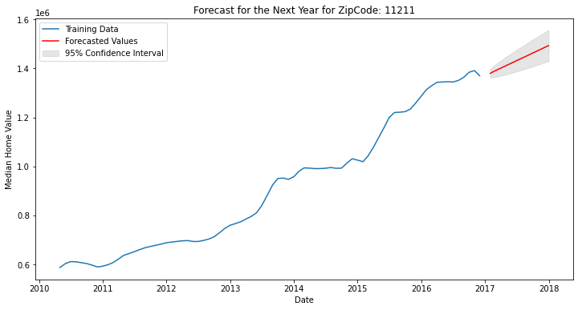
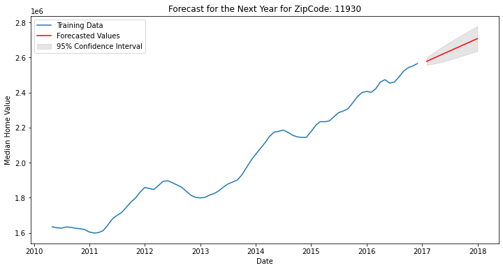
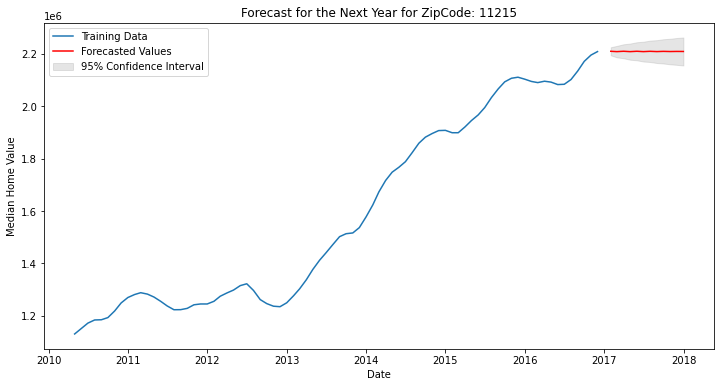
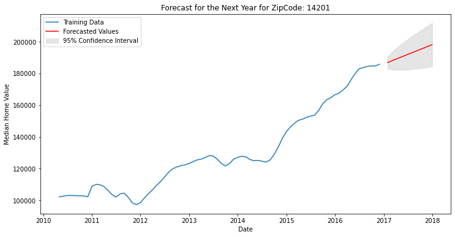
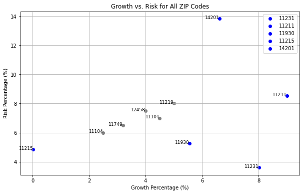

# Real Estate Market Analysis in New York

## Introduction

This comprehensive project leverages advanced predictive analytics to forecast real estate price trends across New York's diverse zip codes. It aims to provide strategic insights for informed investment decisions in the dynamic New York real estate market.

## Business Problem

We are engaged by a leading real estate investment firm, known for its strategic and data-driven approach to the New York property market. The firm seeks to continue its legacy of high-return investments by identifying promising real estate opportunities. The key question is: Can we predict the future trends of property prices in New York's diverse zip codes using historical data?

## Data Overview

We utilize an extensive dataset from Zillow, covering April 1996 to April 2018. This dataset includes critical variables such as RegionID, RegionName (zip codes), and median property values, providing a comprehensive view of the New York real estate landscape.

## Project Approach

1. **Data Preparation & Cleaning**: A meticulous process of standardizing formats and meticulously addressing missing or inconsistent data to ensure the integrity and reliability of the analysis.
2. **Exploratory Data Analysis (EDA)**: A deep dive into the data, unraveling underlying trends, anomalies, and characteristic patterns within the New York real estate market. This phase involves sophisticated data visualization techniques to bring forth hidden insights.
3. **Stationarity Testing & Data Transformation**: Leveraging advanced statistical tests, like the Dickey-Fuller test, to check the stationarity of the data. This step is critical in ensuring the suitability of the data for time series modeling and involves necessary transformations to stabilize variance and mean.
4. **Predictive Modeling & Forecasting**: Constructing ARIMA models for each zip code. This phase involves fine-tuning the models to optimize forecast accuracy and evaluate performance using robust metrics like RMSE (Root Mean Square Error).
5. **Risk Analysis & Model Validation**: Implementing robust cross-validation techniques to ensure the reliability of the models. This phase also integrates comprehensive risk assessment metrics to evaluate the potential financial exposure in each zip code.
   
## Technical Aspects

- Languages & Libraries: Python, Pandas, NumPy, Matplotlib, Seaborn, Statsmodels.
- Techniques: Time Series Analysis, ARIMA Modeling, Data Visualization.

## Results
- **Model Outputs**: In-depth results from ARIMA models for each zip code.
1. **Financial Crisis Impact**: Visual depiction of the real estate market's response to economic downturns, highlighting pivotal trends and recovery phases.
2. **Market Variability**: Distinct growth rates and risk profiles across various zip codes.
3. **Model Precision**: Varied levels of forecasting accuracy; some zip codes offer more reliable predictions.
4. **Investment Opportunities**: Identification of potential investment areas based on growth prospects and risk analysis.

## Recommendations
Based on ARIMA model forecasts, the project suggests top zip codes for investment based on balancing potential growth against associated risks.
   - Top 5 Zip Codes for Investment
     
1. **11231**
   - **Profitability**: Strong growth (8.01% growth percentage).
   - **Risk**: Low (3.61% future risk).
       - Ideal for those seeking growth with low risk.
     

2. **11211**
   - **Profitability**: Significant growth (9.0% growth percentage).
   - **Risk**: Moderate (8.52% future risk).
       - Balanced choice for growth-focused investors.


3. **11930**
   - **Profitability**: Good growth (5.55% growth percentage).
   - **Risk**: Moderate (5.25% future risk).
       - Suitable for medium-term investment strategies.


4. **11215**
   - **Profitability**: Stable, albeit low growth (0.02% growth percentage).
   - **Risk**: Low (4.84% future risk).
       - A conservative option for risk-averse investors.


5. **14201**
   - **Profitability**: Moderate growth (6.61% growth percentage).
   - **Risk**: Moderate (13.82% future risk).
       - A balanced option for investors seeking reasonable growth with manageable risk.


#### Risk-Growth Scatterplot: 
- A visual correlation between predicted growth and associated risk for each zip code.
  


## Next Steps
Suggests deeper analysis into local market trends, historical real estate performance, and broader economic factors to refine investment strategies.

## Conclusion
In conclusion, this project, with its holistic approach and detailed analytics, sheds light on the complex tapestry of New York's real estate market. It guides investors through a labyrinth of data, leading them towards informed decisions that resonate with their investment objectives and risk tolerance. This endeavor stands as a testament to the power of data-driven insights in demystifying the real estate investment landscape.

For a more detailed and technical explanation of the project, please refer to the full project report.
Please view full analysis in [Jupyter Notebook](https://github.com/nv593/Zillow-Analysis/blob/master/ny_analysis.ipynb) or [Presentation](https://github.com/nv593/Zillow-Analysis/blob/master/NY%20Analysis%20Slides.pdf)

### Repository Structure

```
├── visulizations
├── NY Analysis Slides.pdf
├── README.md
├── ny_analysis.ipynb
├── zillow_data.csv
